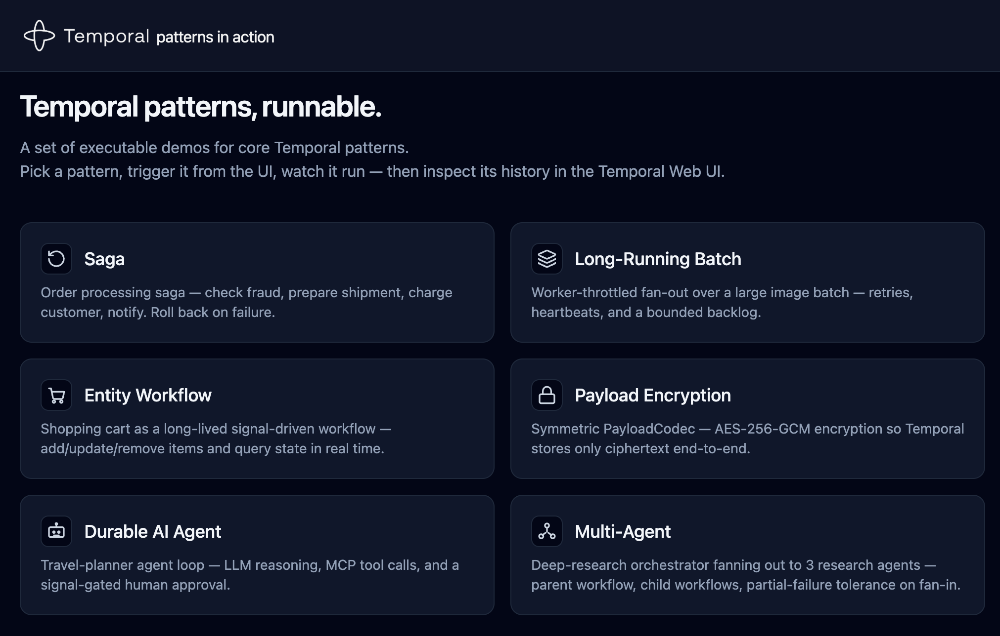
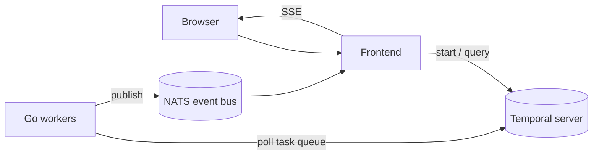

# Temporal Patterns In Action

[](https://github.com/alexandreroman/temporal-patterns-in-action/actions/workflows/ci.yml)
[](LICENSE)

Runnable demos of the core [Temporal](https://temporal.io) patterns —
saga, long-running batch, durable AI agent, payload encryption,
multi-agent deep research — with Go workers and a Frontend to trigger
and observe them.



## Prerequisites

- [Docker](https://www.docker.com/) or
  [Podman](https://podman.io/), with Compose.

## Getting Started

https://github.com/user-attachments/assets/01131162-3e34-4e5a-8bf6-3d16da19a930

Bring up the full stack — Temporal dev server, NATS, the Frontend,
and every worker:

```bash
docker-compose up -d --build
```

Then open:

- UI — <http://localhost:3000>
- Temporal Web UI — <http://localhost:8233>

Stop everything with `docker-compose down`.

## Configuration

| Variable                | Description                        | Default |
| ----------------------- | ---------------------------------- | ------- |
| `BATCH_WORKER_REPLICAS` | Number of `worker-batch` replicas  | `1`     |

The frontend and workers read `TEMPORAL_ADDRESS`, `TEMPORAL_NAMESPACE`,
and `NATS_URL`. Defaults wired in `compose.yaml` cover the
containerized stack; override them only when running outside compose.

## Local development

Prerequisites: Go 1.25+, Node.js 22 LTS, pnpm (via
`corepack enable`), and [Air](https://github.com/air-verse/air)
for worker hot-reload.

Launch Temporal + NATS in containers, then run the frontend and
all workers locally with hot-reload:

```bash
make infra-up
make dev
```

Or work on a single module at a time:

```bash
make frontend     # Nuxt dev server on :3000
make worker-saga  # also: worker-batch, worker-agent
```

Run all checks (lint, build, tests) across modules with
`make check`. Stop the infra with `make infra-down`.

## Architecture



| Module      | Description                                      |
| ----------- | ------------------------------------------------ |
| `workers/`  | Go workers, one binary per pattern               |
| `frontend/` | Nuxt 4 + Vue 3 + Tailwind CSS 4 UI and API       |

### How a run flows

1. The user picks a pattern in the UI and triggers a
   scenario. The Nuxt server route starts a Temporal
   workflow and immediately opens a Server-Sent Events
   (SSE) stream back to the browser.
2. The matching Go worker polls its task queue, runs
   the workflow, and executes activities. Temporal owns
   the durable state — retries, timers, history — so a
   worker crash is replayed, not lost.
3. Each activity publishes lifecycle events
   (`progress.step.started|completed|failed`) to NATS
   via a shared Temporal interceptor. Activities also
   emit business events (e.g.
   `saga.inventory.reserved`) where the pattern needs
   to show domain-level progress.
4. The Nuxt SSE endpoint subscribes to the relevant
   NATS subjects, forwards envelopes to the browser,
   and synthesises a terminal
   `progress.workflow.completed|failed` event from
   `handle.result()` once the workflow ends.

### Why NATS

Temporal is the source of truth for workflow state,
but polling its history from the browser to animate
a live timeline is awkward and lossy. NATS acts as
a **low-latency fan-out bus** between workers and the
frontend:

- **Push, not poll** — activities publish as they
  progress; the UI renders events as they arrive.
- **Subject hierarchy**
  `patterns.<pattern>.<workflowId>.<category>` lets
  the frontend filter per-run, per-pattern, or
  cluster-wide without parsing payloads.
- **Clean Temporal timeline** — publishing happens in
  activity scope (via an interceptor), never from
  workflow code, so the Temporal Web UI stays focused
  on the pattern's real activities with no
  `LocalActivityMarker` clutter.

### Why a frontend

The Temporal Web UI already shows workflow history,
but it is generic by design. This project ships a
purpose-built frontend because the patterns are
**pedagogical**: each one has a story to tell that a
raw event list cannot.

- **One page per pattern**, with a scenario selector
  that lets you pick happy path, partial failure, or
  compensation without editing code.
- **Live timeline** driven by the NATS event stream —
  steps light up in order, compensations highlight in
  a different style, retries are visible.
- **Pattern-specific panels** — saga compensation
  bracket, batch progress bar, agent reasoning / tool
  calls, multi-agent fan-out — render state that
  would be buried in a generic history view.
- **Side-by-side source viewer** pins the exact
  snippet responsible for the step currently running,
  with a language switcher (Go, Java, Python,
  TypeScript) so the UI doubles as a guided tour of
  the code in your SDK of choice.
- **Link back to Temporal Web UI** on every run for
  when you want to inspect raw history, retries, or
  the event payloads directly.

## Patterns

| Pattern                      | Package               |
| ---------------------------- | --------------------- |
| Saga                         | `workers/saga`        |
| Long-running batch           | `workers/batch`       |
| Payload Encryption           | `workers/encryption`  |
| Durable AI Agent             | `workers/agent`       |
| Multi-agent (deep research)  | `workers/multi-agent` |

## License

Apache-2.0 — see [LICENSE](LICENSE).
