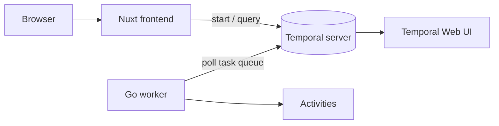

# temporal-patterns-in-action

Runnable demos of the core [Temporal](https://temporal.io)
patterns — saga, long-running workflows, payload
encryption — with a Go worker fleet and a Nuxt UI to
trigger and observe them.

## Features

- **Runnable demos** — trigger each pattern from the UI and
  watch it execute end to end.
- **Polyglot by design** — Go workers host the workflows,
  TypeScript client drives them from a Nuxt server.
- **Live events** — workers publish progress and business
  events to a NATS subject bus; the Nuxt server relays
  them to the browser over Server-Sent Events.
- **Observable** — every run is inspectable in the bundled
  Temporal Web UI.
- **Extensible** — each pattern is a self-contained Go
  package with its own task queue; add new patterns
  without touching existing ones.

## Prerequisites

- [Docker](https://www.docker.com/) (or Podman) — to run
  the Temporal dev server locally.
- [Go](https://go.dev/dl/) 1.25+ — to build the workers.
- [Node.js](https://nodejs.org/) 22 LTS+ and
  [pnpm](https://pnpm.io/) — to run the Nuxt frontend.
  Enable pnpm with `corepack enable`.

## Getting Started

Start the Temporal dev server and NATS event bus:

```bash
make infra-up
```

`make infra-up` starts both Temporal and NATS. The
Temporal Web UI is available at
<http://localhost:8233>.

Alternatively, from the repository root, run `make dev`
to launch the frontend and all workers in one terminal
with hot-reload (requires [`air`](https://github.com/air-verse/air)).
The per-component walkthrough below remains useful when
debugging a single module in isolation.

In a second terminal, run the Go worker:

```bash
cd workers
make tidy
make run-saga
```

In a third terminal, run the Nuxt frontend:

```bash
cd frontend
make install
make dev
```

Open <http://localhost:3000>, pick a pattern, and trigger
a run.

## Usage

The Nuxt UI is the easiest way to trigger a workflow, but
any pattern can also be started from the CLI:

```bash
temporal workflow start \
  --task-queue patterns-saga \
  --type OrderProcessingWorkflow \
  --workflow-id saga-cli-demo \
  --input '{"customerId":"alice","orderId":"order-42","amount":1200,"transactionId":"tx-order-42"}'
```

`transactionId` is the saga's idempotency key: the
same value is reused on every activity retry, so
downstream services can deduplicate. Set `"failAt"`
to `"inventory"`, `"payment"`, or `"shipping"`
in the input to force a compensation scenario.
(`"notification"` fails without triggering a
compensation since it is the terminal step.)

Query progress:

```bash
temporal workflow query \
  --workflow-id saga-cli-demo \
  --type getProgress
```

## Configuration

| Variable             | Description                      | Default                 |
| -------------------- | -------------------------------- | ----------------------- |
| `TEMPORAL_ADDRESS`   | Temporal frontend gRPC address   | `localhost:7233`        |
| `TEMPORAL_NAMESPACE` | Temporal namespace (frontend)    | `default`               |
| `NATS_URL`           | NATS event-bus URL (frontend)    | `nats://localhost:4222` |

## Architecture



| Module      | Description                                         |
| ----------- | --------------------------------------------------- |
| `workers/`  | Go workers, one dedicated binary per pattern demo   |
| `frontend/` | Nuxt 4 + Vue 3 + Tailwind CSS 4 UI and API routes   |

## Patterns

| Pattern               | Status        | Package                      |
| --------------------- | ------------- | ---------------------------- |
| Saga                  | available     | `workers/saga`               |
| Long-running batch    | available     | `workers/batch`              |
| Payload Encryption    | available     | `workers/encryption`         |

## License

Licensed under the Apache-2.0 License — see
[LICENSE](LICENSE) for details.
