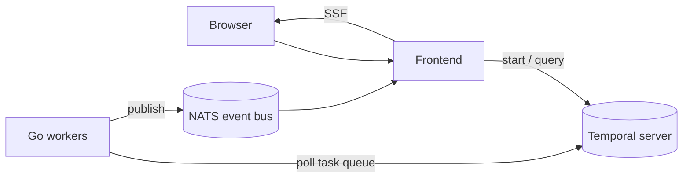

# Temporal Patterns In Action

[](https://github.com/alexandreroman/temporal-patterns-in-action/actions/workflows/ci.yml)
[](LICENSE)

Runnable demos of the core [Temporal](https://temporal.io) patterns —
saga, long-running batch, durable AI agent, payload encryption — with
Go workers and a Frontend to trigger and observe them.

## Prerequisites

- [Docker](https://www.docker.com/) or
  [Podman](https://podman.io/), with Compose.

## Getting Started

Bring up the full stack — Temporal dev server, NATS, the Frontend,
and every worker:

```bash
docker-compose up -d --build
```

Then open:

- UI — <http://localhost:3000>
- Temporal Web UI — <http://localhost:8233>

Stop everything with `docker-compose down`.

## Configuration

| Variable                | Description                        | Default |
| ----------------------- | ---------------------------------- | ------- |
| `BATCH_WORKER_REPLICAS` | Number of `worker-batch` replicas  | `1`     |

The frontend and workers read `TEMPORAL_ADDRESS`, `TEMPORAL_NAMESPACE`,
and `NATS_URL`. Defaults wired in `compose.yaml` cover the
containerized stack; override them only when running outside compose.

## Local development

Prerequisites: Go 1.25+, Node.js 22 LTS, pnpm (via
`corepack enable`), and [Air](https://github.com/air-verse/air)
for worker hot-reload.

Launch Temporal + NATS in containers, then run the frontend and
all workers locally with hot-reload:

```bash
make infra-up
make dev
```

Or work on a single module at a time:

```bash
make frontend     # Nuxt dev server on :3000
make worker-saga  # also: worker-batch, worker-agent
```

Run all checks (lint, build, tests) across modules with
`make check`. Stop the infra with `make infra-down`.

## Architecture



| Module      | Description                                      |
| ----------- | ------------------------------------------------ |
| `workers/`  | Go workers, one binary per pattern               |
| `frontend/` | Nuxt 4 + Vue 3 + Tailwind CSS 4 UI and API       |

## Patterns

| Pattern            | Package              |
| ------------------ | -------------------- |
| Saga               | `workers/saga`       |
| Long-running batch | `workers/batch`      |
| Payload Encryption | `workers/encryption` |
| Durable AI Agent   | `workers/agent`      |

## License

Apache-2.0 — see [LICENSE](LICENSE).
